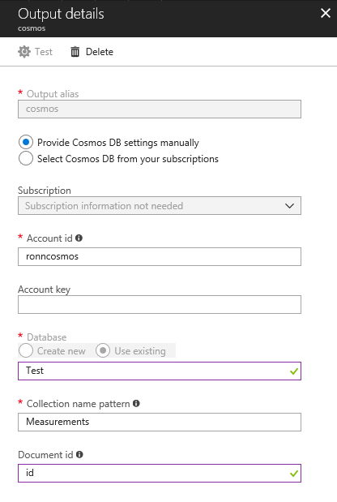

# Processing old and real time data in a single Stream Analytics Job

This document demonstrates how to use Stream Analytics to process ingested data in different time ranges (past and present).

Disclamer: this is not a complete solution, but some basic information on how you can solve similar problems.

## Scenario

We ran into a customer IoT scenario where a Bluetooth Low Energy device would use a phone as a gateway to send measurement data to IoT Hub for further processing. The measurements should be aggregated in intervals of 3 minutes and saved into Cosmos DB for data visualization purposes. We choosed Stream Analytics as the data processing engine because it fulfills our requirements (IoT Hub/Event Hub ingestion, interval aggregates, Cosmos DB output).


The processing flow is the following:
1. Bluetooth device records measurements every second, sending them to the Phone (gateway) every minute (in total 60 measurements). In case the connection to the phone is unnavailable the measurements are queued up in the device and sent once the connection is resumed. Queued measurements are send in order of capture (FIFO).
2. The phone sends the measurements to IoT Hub in real time. If there is no connection to Internet the phone will queue the measurements and send them once the connection is established. The measurements are sent in order of capture (FIFO)
3. Stream Analytics aggregates the measurements in 3 minutes window and store in Cosmos DB.

## Challenges

The particularity of this scenario is having to process past and present data in the same pipeline using Stream Analytics. The measurements reaching Stream Analytics can be in real time or in the past, depending on the connectivity between device-phone-internet. We had to ensure that we processed aggregated data in the correct order and for each device independently. 

To help you understand the scenario look at example payloads:

Assuming now is March 6th 2018 12:00:00 (GMT), unix time 1520337600.

Measurements from Device1 are coming late, due to connection issues (captured one day ago, March 5th 2018 12:00:00 GMT):
```json
[{ "deviceid": "device1", "temperature": 20.3, "measurementTimestamp": "1520251200" }, { "deviceid": "device1", "temperature": 20.4, "measurementTimestamp": "1520251201" }]
```

Device2 is sending real-time measurements (captured at March 6th 2018 11:59:50 GMT)
```json
[{ "deviceid": "device2", "temperature": 20.3, "measurementTimestamp": "1520337590" }, { "deviceid": "device2", "temperature": 20.4, "measurementTimestamp": "1520337591" }]
```

To create an aggregate using tumbling window in Stream Analytics we started with the following query:

```sql
SELECT 
    deviceid, 
    AVG(temperature) as value,
    COUNT(*),
    System.Timestamp as timerange
INTO Cosmos
FROM IoTHub
TIMESTAMP BY DATEADD(second,[measurementTimestamp],'1970-01-01T00:00:00Z')
GROUP BY deviceId, TumblingWindow(Duration(minute,3)) 
```

In Stream Analytics you can either use the timestamp of the message (enqueued time) or a defined application timestamp. In our case we need to make sure that the aggregates are based on the time of capture and not on the message enqueue time, therefore the TIMESTAMP was based on the field "measurementTimestamp".

The query above aggregated the temperature on a 3 minute window and saved it to a Cosmos DB collection. The query works perfectly as long as all devices are sending real time data to IoT Hub.

### What if data is not coming in order?

If you cannot guarantee that the complete travel from the device to Stream Analytics maintains the messages in correct order, something that Stream Analytics is expecting by default, you can introduce a waiting time to allow Stream Analytics to reorder the messages. Depending on the use case it can be from seconds to minutes.

This waiting time can be set in the "Out of Order events" settings of a Stream Analytics Job (under Event Ordering). In our case, to be safe, we set it to 5 minutes, but we could have used a shorter time.


### What if incoming data is too old?

Measurements can arrive in IoT Hub much later than the captured time due to connections issues between the device and IoT Hub or clock skew between devices and/or servers. To define how Stream Analytics handle this scenarios we can set the "Late Arrival Policy". In this setting we define the tolerance window between the event capture and the enqueue time and what should happen to events out of the tolerance window (drop or adjust).

The default setting is 5 seconds window, using the Adjust action. This setting will cause late events (event timestamp < current IoT Hub enqueue time - 5 seconds) to be adjusted as if they would have happened 5 seconds behind the IoT Hub enqueue time.

The default settings does not work for our scenario, because devices will be sending data that is much older and we don't want to adjust the timestamp of the measurements because it would result in innacurate aggregates. Moreover, in our scenario we had to aggregate measurements that were recorded up to 20 days in the past although the measurement message was received today (Stream Analytics allows at maximum the processing of data that was recorded 21 days ago).

### What happens to the data that does not fall in the 20 days or 5 minutes out of order policy?

You have two options: adjust or drop.
Using adjust will change the timestamp of the measurement to the current time. Unfortunately for our scenario it would result in inaccurate aggregations.

Drop will simply ignore the measurements. This is the setting we used in our scenario.


### Current time per device, not global

The changes to the event ordering allowed us to process old and near real time data. However with the previous Stream Analytics query the tumbling window is shared by all devices, meaning that you cannot process date ranges that are different by device. To better understand look at the example below:

- 10:00 AM: Device1 sends data from 2 days ago. Data is processed and Stream Analytics time window is set to 2 days ago.
- 10:30 AM: Device2 sends data from 3 days ago. Data is not processed since Stream Analytics time window is currently at 2 days ago.
- 11:00 AM: Device3 sends real time data. Data is processed and Stream Analytics updates it's current time window to now, not allowing old data to be processed again.

What we need is a tumbling window per device. To do so we had to change the query to:
```sql
SELECT 
    deviceid, 
    AVG(temperature) as value,
    COUNT(*),
    System.Timestamp as timerange
INTO Cosmos
FROM IoTHub
TIMESTAMP BY DATEADD(second,[measurementTimestamp],'1970-01-01T00:00:00Z') OVER deviceid, PartitionId
GROUP BY deviceId, TumblingWindow(Duration(minute,3)), PartitionId
```

The OVER clause will make Stream Analytics keep a tumbling window per deviceid and PartitionId (PartitionId is a requirement of the OVER clause). In our case the PartitionId is based on the deviceid as explained [here](https://docs.microsoft.com/en-us/azure/iot-hub/iot-hub-devguide-messages-d2c). If you use Event Hub instead of IoT Hub ensure that the partition key is set to deviceid in order to have all messages from a device in order and in the same partition.

Using OVER clause in a Stream Analytics query has some limitations. For instance, you cannot use reference data. For more details check [here](https://msdn.microsoft.com/en-us/azure/stream-analytics/reference/timestamp-by-azure-stream-analytics#over-clause-interacts-with-event-ordering). Our scenario required the usage of reference data. We opted to output the aggregates to an Event Hub and have a second Stream Analytics doing the reference data join, sending the final results to a Cosmos DB collection.


One important thing to keep in mind when processing old data is that you should set the start time when starting/restarting the Stream Analytics Job. You have to specifically choose the date in the past that should be included in the processing period. In our case, chosing a date older than 20 days.


This settings causes a side effect when restarting a Stream Analytics Job, it will process again all messages in the IoT Hub (or Event Hub) that were enqueued within the time range and are still stored in the queue due to the retention policy. To avoid reprocessing a huge amount of data we recommend using a retention policy of 1 day. Anyhow, Stream Analytics will still process and save duplicated records within this 1 day.

In general Stream Analytics guarantees [at least once delivery](https://blogs.msdn.microsoft.com/streamanalytics/2017/01/13/how-to-achieve-exactly-once-delivery-for-sql-output/). It is a good practice to have mechanisms in place to avoid data duplication in your output sinks (Cosmos DB, Sql Server, etc). In our scenario is even more important because we know we would process data more than once.

In Cosmos DB we avoid data duplication by setting the document id in the output properties in Stream Analytics. We also have to change the query to create a unique id per aggregate. In Cosmos DB the document identifier is always the property "id".
```sql
SELECT 
    id = CONCAT(deviceid,':temperature:', cast(system.TimeStamp AS nvarchar(max))),
    deviceid, 
    AVG(temperature) as value,
    COUNT(*),
    System.Timestamp as timerange
INTO Cosmos
FROM IoTHub
TIMESTAMP BY DATEADD(second,[measurementTimestamp],'1970-01-01T00:00:00Z') OVER deviceid, PartitionId
GROUP BY deviceId, TumblingWindow(Duration(minute,3)), PartitionId
```



Finally we have a system that can process older and real time data per device independently. To better illustrate how data is processed by Stream Analytics with our settings look at the schema below:

```
Current clock on Azure:             30.1.2018 12:03
SA settings:
Events that arrive late:            21 days
Out of order events:                5 minutes
Handling other events:              Drop
IoT Hub retention:                  1 day
Start SA job with a start date of   1.1.2018
```


This document was created by Ronnie Saurenmann and Francisco Beltrao.